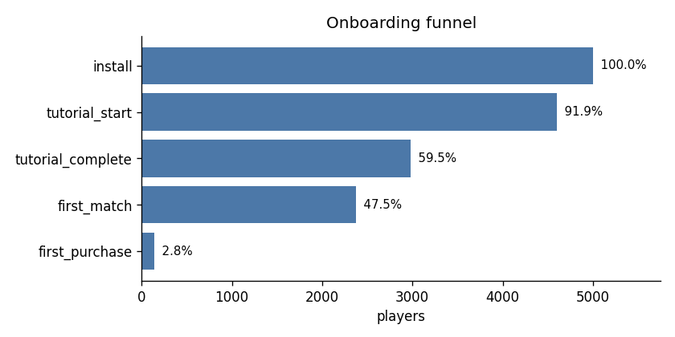
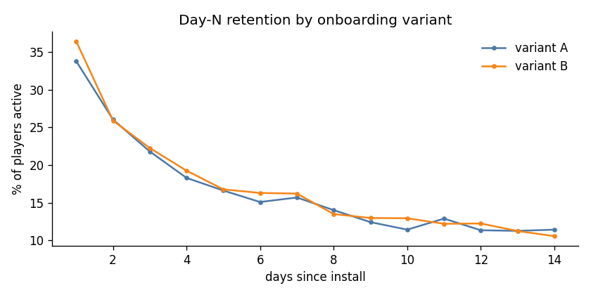

# Player analytics report

## Data quality

| raw_events | duplicates_removed | other_rows_removed | clean_events | players |
|---|---|---|---|---|
| 39185 | 768 | 159 | 38258 | 5000 |

## Onboarding funnel

| step | name | players | pct_of_installs | pct_of_previous |
|---|---|---|---|---|
| 1 | install | 5000 | 100.0 |  |
| 2 | tutorial_start | 4597 | 91.9 | 91.9 |
| 3 | tutorial_complete | 2976 | 59.5 | 64.7 |
| 4 | first_match | 2376 | 47.5 | 79.8 |
| 5 | first_purchase | 142 | 2.8 | 6.0 |

## Retention

| day | eligible | retained | retention_pct |
|---|---|---|---|
| 1 | 5000 | 1756 | 35.1 |
| 3 | 5000 | 1102 | 22.0 |
| 7 | 5000 | 798 | 16.0 |
| 14 | 5000 | 550 | 11.0 |

## Onboarding experiment (A = original tutorial, B = shorter tutorial)

| variant | players | completed_tutorial | d7_eligible | d7_retained |
|---|---|---|---|---|
| A | 2503 | 1417 | 2503 | 393 |
| B | 2497 | 1578 | 2497 | 405 |

- **Tutorial completion (primary):** A 56.6% vs B 63.2% (lift +11.6%, 95% CI for the difference +3.9% to +9.3%, z = 4.75, p < 0.0001, significant at 5%)
- **D7 retention (guardrail):** A 15.7% vs B 16.2% (lift +3.3%, 95% CI for the difference -1.5% to +2.5%, z = 0.50, p = 0.6168, not significant at 5%)
